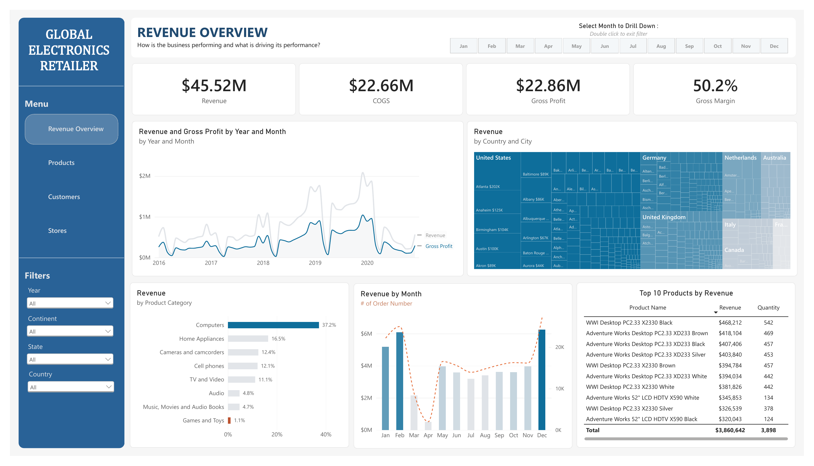

# Global Electronics Retailer — Power BI Dashboard

An end-to-end Power BI project analyzing five years of sales performance for a global electronics retailer — from raw CSV/Excel exports to a four-page interactive dashboard and a written performance report.



## Overview

The dataset covers **62,884 order lines** placed between **January 2016 and February 2021**, across **8 product categories**, **66 stores in 8 countries**, and **11,887 customers**. The project turns that raw transactional data into a star-schema semantic model with DAX measures, then surfaces it through an interactive report built for a business audience.

**Headline numbers:**
- **$46.4M** total revenue, **50.2%** blended gross margin
- **26,326** orders recorded, **$1,763** average order value
- **61%** repeat-purchase rate across 11,887 customers
- Revenue **declined 48.7%** in 2020 — driven entirely by order volume, not pricing

## Dashboard pages

| Page | Question it answers |
|---|---|
| **Revenue Overview** | How is the business performing, and what's driving it? |
| **Products** | What's selling, and at what margin? |
| **Customers** | Who are our customers, and where are they found? |
| **Stores** | Which locations are earning their footprint? |

Each page shares a common filter panel (Year, Continent, State, Country) and a click-to-drill month selector, so any view can be sliced down to a single country, category, or month in a couple of clicks.

## Data model

A star schema built around a central fact table:

- **Fact_Sales** — order-line grain transactions
- **Dim_Customers, Dim_Products, Dim_Stores, Dim_Date** — descriptive dimensions
- **Exchange_Rates** — multi-currency support
- Supporting measure and parameter tables for dynamic field/dimension switching across visuals

## Tools & process

Built following the **APASSA** framework (Ask → Prepare → Process → Analyze → Share → Act):

- **Excel** — initial data cleaning (deduplication, date standardization, blank handling)
- **Power Query / Power BI** — feature engineering and data modeling
- **DAX** — calculated measures (margin, repeat-customer share, revenue per customer, etc.)
- **Power BI Desktop** — report design, gradient-based conditional formatting, and dynamic field parameters

## Repo contents

```
├── Global Electronics Retailer.pbix     # Standalone Power BI file
├── CSV Data / Excel Data                # Source data exports
├── Global Electronics Retailer Dashboard Overview.pdf   # Full dashboard screenshots
└── Process Documentations.docx          # Data prep & methodology notes
```

## Getting started

1. Clone or download this repository.
2. Open `Global Electronics Retailer.pbip` in [Power BI Desktop](https://www.microsoft.com/power-bi/) (recommended — no packaged signature, plays nicely with version control).
3. Explore the four report pages via the left-hand menu, or use the filters to drill into a specific market.

## Key insight

> Four product categories carry 73% of revenue, eight stores plus one online channel carry a fifth of it, and margin ranges 21 points across subcategories doing similar volume. The 2020 revenue decline came from fewer orders — not lower prices.

See the full [Analytical Report](Global%20Electronics%20Retailer%20Analytical%20Report.pdf) for the complete breakdown.
